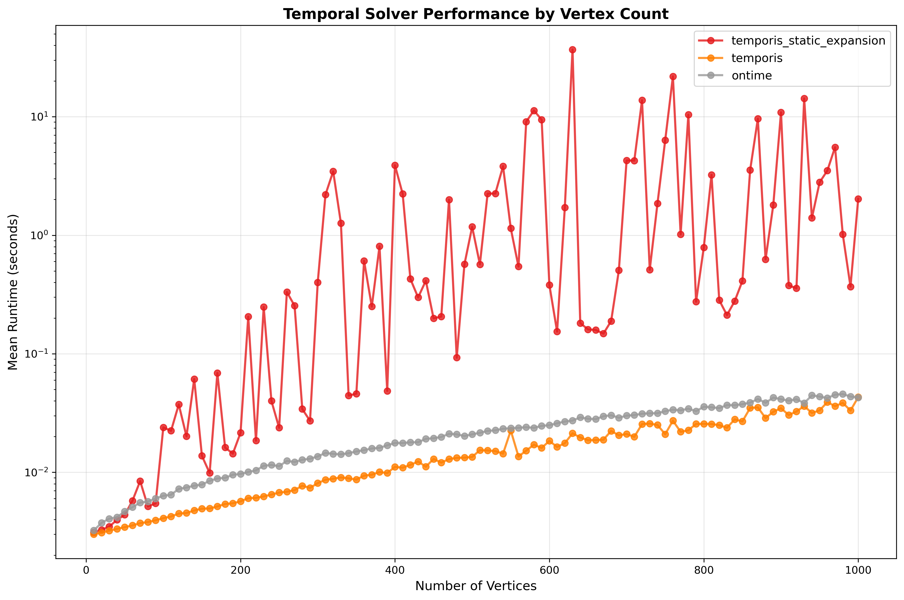
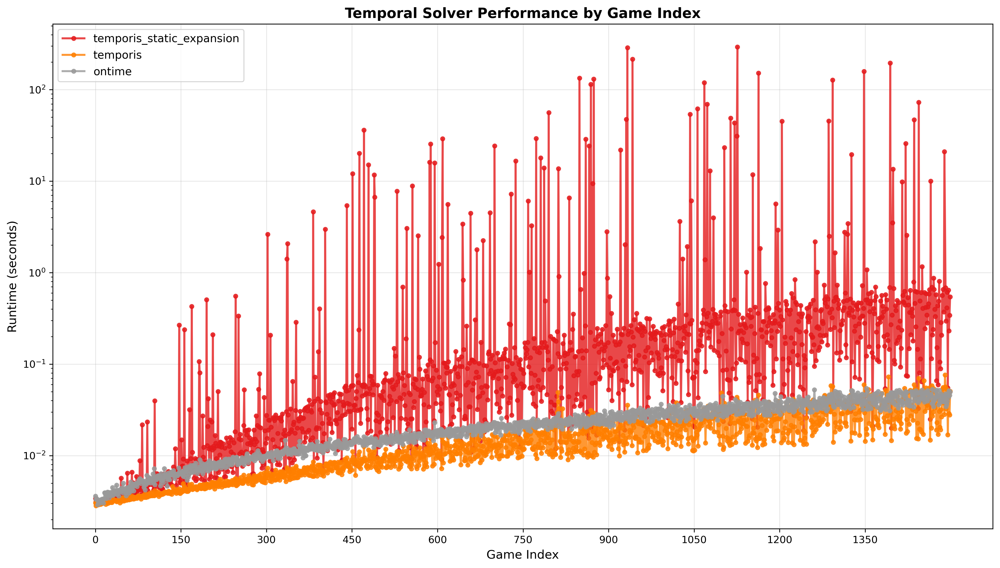

# Temporal Solver Benchmark Experiment

### Required Software
```bash
# C++ Build Tools
sudo apt install cmake build-essential

# Python 3 with plotting libraries
sudo apt install python3 python3-pip
pip3 install matplotlib numpy

# Rust (for Ontime)
curl --proto '=https' --tlsv1.2 -sSf https://sh.rustup.rs | sh
source .cargo/env

# Boost Libraries (for Temporis/GGG)
sudo apt install libboost-all-dev
```

### Repository Setup
```bash
# Clone required repositories
git clone https://github.com/gamegraphgym/ggg.git
git clone https://github.com/petejaustin/ontime.git
git clone https://github.com/petejaustin/temporis.git 
git clone https://github.com/gamegraphgym/case-study-temporal-games.git
```

### 1. Build GGG (Game Graph Gym)
```bash
cd ggg
cmake -S . -B build -DCMAKE_BUILD_TYPE=Release -DTOOLS_ALL=ON
cmake --build build -j$(nproc)
```

### 2. Build Temporis Solvers
```bash
cd temporis
cmake -S . -B build -DCMAKE_BUILD_TYPE=Release
cmake --build build

# Verify builds
ls temporis/build/temporis_solvers/temporis
ls temporis/build/temporis_solvers/temporis_static_expansion
```

### 3. Build Ontime
```bash
cd ontime
cargo build --release

# Verify build
ls ontime/target/release/ontime
```

### 4. Generate Test Games
```bash
python3 ggg/extra/scripts/generate_games.py
```

This creates:
- `temporis_games/`: 1,500 DOT format games (test00001.dot - test01500.dot)
- `ontime_games/`: 1,500 TG format games (test00001.tg - test01500.tg)

### 5. Benchmark Temporis
```bash
bash ggg/extra/scripts/benchmark.sh temporis_games temporis/build/temporis_solvers 300
```

### 6. Benchmark Ontime
```bash
bash case-study-temporal-games/benchmark_ontime.sh ontime_games ontime/target/release/ontime 300
```

### 7. Consolidate Results
```bash
python3 case-study-temporal-games/consolidate_results.py ggg/extra/scripts/results.json case-study-temporal-games/ontime_results.json -o full_results.json
```

### 8. Generate Visualizations
```bash
# Performance by vertex count (scalability analysis)
python3 ggg/extra/scripts/plot_time_by_vertex_count.py full_results.json --output-dir . --title "Temporal Solver Performance by Vertex Count"

# Individual game performance
python3 ggg/extra/scripts/plot_time_by_game_index.py full_results.json --output-dir . --title "Temporal Solver Performance by Game Index"
```

**Output Files:**
- `scalability_by_vertex_count.png`: Scalability comparison
- `individual_game_performance.png`: Per-game performance plot

## Results




## Further Notes

As we wanted to experiment with having such temporal implementations in different languages, Ontime was also built by us. This works in a simpler way that does not use GGG. Unlike Temporis (and also GGG), the target subset for Ontime is directly provided in the command line parameters. As well as this the time bound used in Ontime, otherwise known as the horizon of the game, is provided as a command line parameter and not as input. The benchmark needed for Ontime is also a mildly modified version of the shell script provided with GGG.

One of the first experiments we wanted to carry out was to test the run times of both Temporis and the release build of Ontime against each other, so we had to write some auxillary scripts that would be able to do this.
These are the game consolidator, and the game generator to convert the input. Games were generated for Temporis and then adapted to fit Ontime.

As the rust tool originally does not read the GGG input format nor produce compatible json output; a fork with compatible interface was made. This is provided in the Repository Setup.